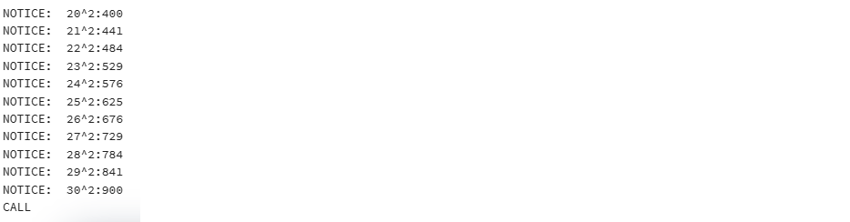
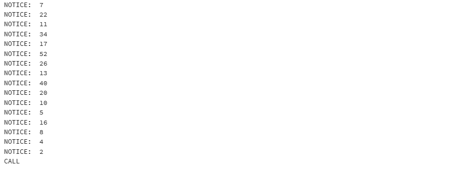
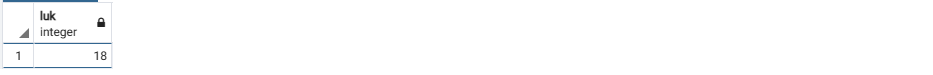
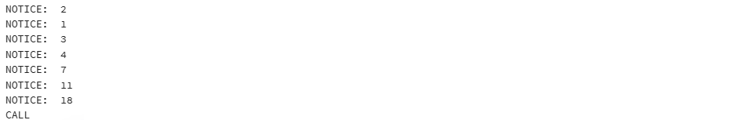
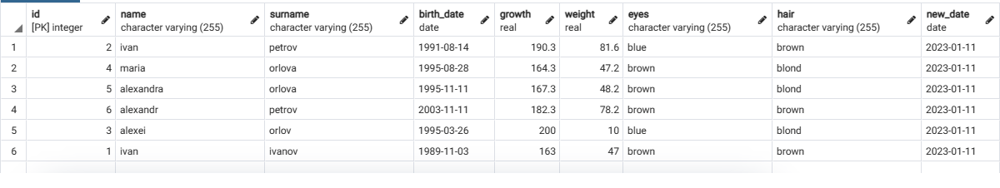

1. Выведите на экран любое сообщение
~~~plpgsql
 SELECT 'Hello'
 ~~~
  В результате выводится сообщение
 
 
 2. Выведите на экран текущую дату
 ~~~plpgsql
 SELECT NOW()
 ~~~
 В результате выводится дата
 

3. Создайте две числовые переменные и присвойте им значение. Выполните математические действия с этими числами и выведите результат на экран.
~~~plpgsql
CREATE FUNCTION znach(x int, y int) RETURNS int AS $$
BEGIN
    RETURN x * y;
END
$$ LANGUAGE plpgsql
~~~
Полсле этого выполняется запрос
~~~plpgsql
SELECT znach(10,7)
~~~
 В результате выводится значение
 

 4. Написать программу двумя способами 1 - использование IF, 2 - использование CASE. Объявите числовую переменную и присвоейте ей значение. Если число равно 5 - выведите на экран "Отлично". 4 - "Хорошо". 3 - Удовлетворительно". 2 - "Неуд". В остальных случаях выведите на экран сообщение, что введённая оценка не верна.

Через IF
~~~plpgsql
 CREATE FUNCTION mark(x int) RETURNS char AS $$
BEGIN
    IF (x = 2) THEN RETURN 'Не удовлетворительно';
	  ELSIF (x = 3) THEN RETURN 'Удовлетворительно';
	  ELSIF (x = 4) THEN RETURN 'Хорошо';
	  ELSIF (x = 5) THEN RETURN 'Отлично';
	  ELSE RETURN 'Введите число от 2 до 5';
	  END IF;
END
$$ LANGUAGE plpgsql
~~~
Вызывается
~~~plpgsql
SELECT mark(4)
~~~

Через CASE
~~~plpgsql
CREATE FUNCTION mark1(x int) RETURNS char AS $$
BEGIN
    CASE WHEN x = 2 THEN RETURN 'Не удовлетворительно';
	WHEN x = 3 THEN RETURN 'Удовлетворительно';
	WHEN x = 4 THEN RETURN 'Хорошо';
	WHEN x = 5 THEN RETURN 'Отлично';
	ELSE RETURN 'Введите число от 2 до 5';
	END CASE;
END
$$ LANGUAGE plpgsql
~~~
А здесь 
~~~plpgsql
SELECT mark1(3)
~~~

5. Выведите все квадраты чисел от 20 до 30 3-мя разными способами (LOOP, WHILE, FOR)

Через LOOP
~~~plpgsql
CREATE PROCEDURE kvadr() AS $$
DECLARE
	x int := 20;
BEGIN
LOOP
	RAISE NOTICE '%^2:%', x, x*x;
	x := x + 1;
	EXIT WHEN x > 30;		
END LOOP;
END
$$ LANGUAGE plpgsql;
~~~

Через WHILE
~~~plpgsql
CREATE PROCEDURE kvadr() AS $$
DECLARE
	x int := 20;
BEGIN
WHILE x <= 30 LOOP
	RAISE NOTICE '% ^ 2 : %', x, x*x;
	x := x + 1;	
END LOOP;
END
$$ LANGUAGE plpgsql;
~~~
Через FOR
~~~plpgsql
CREATE PROCEDURE kvadr() AS $$
BEGIN
FOR x IN 20..30 LOOP
	RAISE NOTICE '%^2:%', x, x*x;	
END LOOP;
END
$$ LANGUAGE plpgsql;
~~~
Вызов
~~~plpgsql
CALL kvadr();
~~~

6. Последовательность Коллатца. Берётся любое натуральное число. Если чётное - делим его на 2, если нечётное, то умножаем его на 3 и прибавляем 1. Такие действия выполняются до тех пор, пока не будет получена единица. Гипотеза заключается в том, что какое бы начальное число n не было выбрано, всегда получится 1 на каком-то шаге. Задания: написать функцию, входной параметр - начальное число, на выходе - количество чисел, пока не получим 1; написать процедуру, которая выводит все числа последовательности. Входной параметр - начальное число.

Функция
~~~plpgsql
CREATE FUNCTION chislo(x int) RETURNS int AS $$
DECLARE
	amount int := 0;
BEGIN
	WHILE x != 1 LOOP
		IF mod(x, 2) = 0 THEN
			x := x / 2;
		ELSE
			x := x * 3 + 1;
		END IF;
		amount := amount + 1;
	END LOOP;
RETURN amount;
END
$$ LANGUAGE plpgsql;
~~~
~~~plpgsql
SELECT chislo(7)
~~~

Процедура
~~~plpgsql
CREATE PROCEDURE chislo1(x int) AS $$
BEGIN
	WHILE x != 1 LOOP
		RAISE NOTICE '%', x;
		IF mod(x, 2) = 0 THEN
			x := x / 2;
		ELSE
			x := x * 3 + 1;
		END IF;
	END LOOP;
END
$$ LANGUAGE plpgsql;
~~~
Вызов
~~~plpgsql
CALL chislo1(7)
~~~

7. Числа Люка. Объявляем и присваиваем значение переменной - количество числе Люка. Вывести на экран последовательность чисел. Где L0 = 2, L1 = 1 ; Ln=Ln-1 + Ln-2 (сумма двух предыдущих чисел). Задания: написать фунцию, входной параметр - количество чисел, на выходе - последнее число (Например: входной 5, 2 1 3 4 7 - на выходе число 7); написать процедуру, которая выводит все числа последовательности. Входной параметр - количество чисел.

~~~plpgsql
CREATE FUNCTION luk(x int) RETURNS int AS $$
DECLARE
L0 int := 2;
L1 int := 1;
L2 int;
BEGIN
	FOR x IN 3..x LOOP
		L2 := L1 + L0;
		L0 := L1;
		L1 := L2;
	END LOOP;
	RETURN L2;
END
$$ LANGUAGE plpgsql;
~~~
Вызов
~~~plpgsql
SELECT luk(7)
~~~

Процедура
~~~plpgsql
CREATE PROCEDURE luk1(x int) AS $$
DECLARE
L0 int := 2;
L1 int := 1;
L2 int;
BEGIN
	RAISE NOTICE '%', L0;
	RAISE NOTICE '%', L1;
	FOR x IN 3..x LOOP
		L2 := L1 + L0;
		L0 := L1;
		L1 := L2;
		RAISE NOTICE '%', L2;
	END LOOP;
END
$$ LANGUAGE plpgsql;
~~~
Вызов
~~~plpgsql
CALL luk1()
~~~

8. Напишите функцию, которая возвращает количество человек родившихся в заданном году.
~~~plpgsql
    CREATE FUNCTION chel(birth int) RETURNS int AS $$
    DECLARE
        kolvo int;
    BEGIN
        SELECT count(*) INTO kolvo
        FROM people
        WHERE EXTRACT(year FROM people.birth_date) = birth;
        RETURN kolvo;
    END
    $$ LANGUAGE plpgsql;
~~~
Вызов
~~~plpgsql
SELECT chel(1995)
~~~

9. Напишите функцию, которая возвращает количество человек с заданным цветом глаз.

~~~plpgsql
CREATE FUNCTION eye(color varchar) RETURNS int AS $$
DECLARE
	kolvo int;
BEGIN
	SELECT count(*) INTO kolvo
	FROM people
	WHERE people.eyes = color;
	RETURN kolvo;
END
$$ LANGUAGE plpgsql;
~~~
Вызов
~~~plpgsql
SELECT eye('blue');
~~~

10. Напишите функцию, которая возвращает ID самого молодого человека в таблице.

~~~plpgsql
CREATE FUNCTION id() RETURNS int AS $$
DECLARE
	age int;
BEGIN
	SELECT id INTO age
	FROM people
	WHERE birth_date = (SELECT max(birth_date) FROM people);
	RETURN age;
END
$$ LANGUAGE plpgsql;
~~~
Вызов
~~~plpgsql
SELECT id();
~~~

13. Напишите процедуру, которая позволяет создать в БД нового человека с указанным родством.

~~~plpgsql
CREATE PROCEDURE link(id int, name varchar, id2 int, name2 varchar, link varchar) AS $$
DECLARE
BEGIN
INSERT INTO people (id, name)
VALUES (id, name);
IF NOT EXISTS (SELECT * FROM people WHERE id = id2) THEN
INSERT INTO people (id, name)
VALUES (id2, name2);
END IF;
INSERT INTO links (people_id, people_id_2, link)
VALUES (id, id2, link); 
END;
$$ LANGUAGE plpgsql
~~~

14. Измените схему БД так, чтобы в БД можно было хранить время актуальности данных человека (выполнить также, как п.12).

Создаем новый столбец
~~~plpgsql
ALTER TABLE people ADD COLUMN update_date date default now()
~~~

15. Напишите процедуру, которая позволяет актуализировать рост и вес человека.

~~~plpgsql
CREATE PROCEDURE height_weight(id1 int, height1 numeric, weight1 numeric) AS $$
BEGIN
	UPDATE people SET growth = height1 WHERE id = id1;
	UPDATE people SET weight = weight1 WHERE id = id1;
	UPDATE people SET new_date = now() WHERE id = id1;
END;
$$ LANGUAGE plpgsql
~~~
Вызов
~~~plpgsql
CALL height_weight2(1, 163, 47)
~~~

